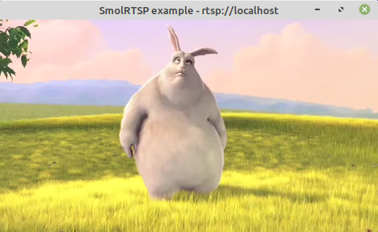

# SmolRTSP
[](https://github.com/OpenIPC/smolrtsp/actions)
[](https://openipc.github.io/smolrtsp/)

SmolRTSP is a simple [RTSP 1.0] server library tailored for embedded devices, such as IP cameras. It supports both TCP and UDP, allows any payload format, and provides a convenient and flexible API.

[RTSP 1.0]: https://datatracker.ietf.org/doc/html/rfc2326

## Highlights

 - **Small.** SmolRTSP is designed for use in embedded systems (e.g., IP cameras).
 - **Unopinionated.** You can use SmolRTSP with bare POSIX sockets, [libevent], or any other network framework.
 - **Zero-copy.** SmolRTSP does not allocate or copy data while parsing.
 - **Battle-tested.** SmolRTSP is used by [Majestic], an IP camera streamer developed by [OpenIPC].

[libevent]: https://libevent.org/
[array slices]: https://github.com/hirrolot/slice99
[Majestic]: https://openipc.github.io/wiki/en/majestic-streamer.html
[OpenIPC]: https://openipc.org/

## Features

 - Supported protocols:
   - [x] RTSP 1.0 ([RFC 2326])
   - [x] RTP ([RFC 3550])
   - [x] RTP over TCP (interleaved binary data)
   - [x] RTP over UDP
   - [x] SDP ([RFC 4566])
   - [ ] RTCP
 - Supported RTP payload formats:
   - [x] H.264 ([RFC 6184])
   - [x] H.265 ([RFC 7798])

[RFC 3550]: https://datatracker.ietf.org/doc/html/rfc3550
[RFC 4566]: https://datatracker.ietf.org/doc/html/rfc4566
[RFC 2326]: https://datatracker.ietf.org/doc/html/rfc2326
[RFC 6184]: https://datatracker.ietf.org/doc/html/rfc6184
[RFC 7798]: https://datatracker.ietf.org/doc/html/rfc7798

## Installation

If you use CMake, the recommended way is [`FetchContent`]:

[`FetchContent`]: https://cmake.org/cmake/help/latest/module/FetchContent.html

```cmake
include(FetchContent)

FetchContent_Declare(
    smolrtsp
    URL https://github.com/OpenIPC/smolrtsp/archive/refs/tags/v1.2.3.tar.gz # v1.2.3
)

FetchContent_MakeAvailable(smolrtsp)

target_link_libraries(MyProject smolrtsp)
```

### Options

| Option | Description | Default |
|--------|-------------|---------|
| `SMOLRTSP_SHARED` | Build a shared library instead of static. | `OFF` |
| `SMOLRTSP_FULL_MACRO_EXPANSION` | Show full macro expansion backtraces (**DANGEROUS**: may impair diagnostics and slow down compilation). | `OFF` |

## Usage

A simple example server that streams H.264 video and G.711 Mu-Law audio can be found at [`examples/server.c`](examples/server.c).



Run it as follows:

```
$ mkdir examples/build
$ cd examples/build
$ cmake .. && cmake --build .
$ sudo ./server
```

Then open a new terminal window to start playing:

```
$ ffplay rtsp://localhost
```

## Integration

SmolRTSP is agnostic to a network backend: you can run it atop of any network/event loop framework. Currently, we support the following integrations:

 - [`OpenIPC/smolrtsp-libevent`](https://github.com/OpenIPC/smolrtsp-libevent) ([libevent](https://libevent.org/))

Feel free to extend this list with your own integration code.

## Release procedure

 1. Update the `PROJECT_NUMBER` field in `Doxyfile`.
 2. Update `CHANGELOG.md`.
 3. Release the project in [GitHub Releases].

[GitHub Releases]: https://github.com/OpenIPC/smolrtsp/releases
